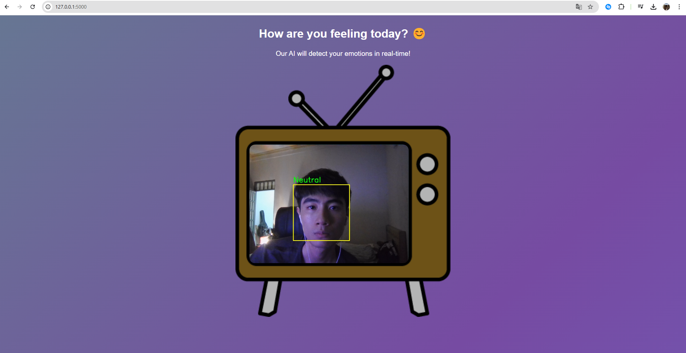

# Emotion_Detection_CNN

Data Set Link - https://www.kaggle.com/jonathanoheix/face-expression-recognition-dataset

## 🚀 How to Run the Project

### 🔹 1. Train model from Scratch

```bash
python train-model.py
```
### 🔹 2. For quick demo (on local)
```bash
python main.py
```
### 🔹 3. For app implementation
```bash
python app.py
```
And then click on the url given (something like: http://127.0.0.1:5000)

### 🔹 4. UI

When open the app, here is the UI you'll see:

The expression detector will change based on your own expression on the face
